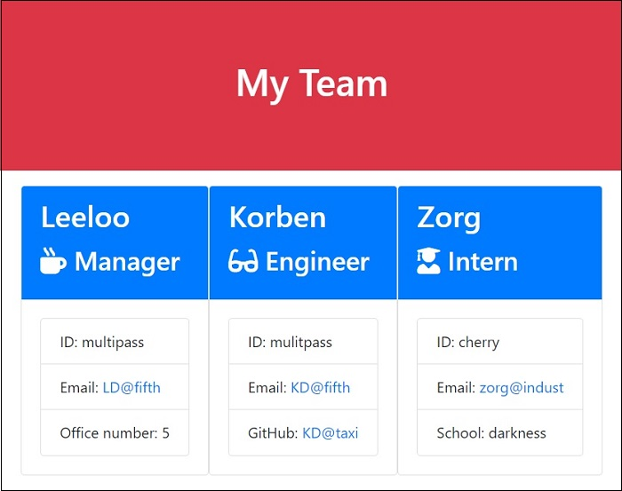
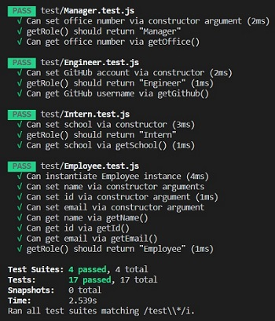

# Team Profile Generator

 

  ### Description
  A node CLI app that generates a team profile, Inquirer is use for input prompts and Jest used for testing. The user will follow the prompts to input necessary info, a validator will check if the info is acceptable. In the end a team's profile will be generated and visible in the output directory.
  
  ### Table of Contents
  - [Description](#description)
  - [Demo](#Demo)
  - [Implementation](#Implementation)
  - [Installation](#installation)
  - [Usage](#usage)
  - [Contribution](#Contribution)
  - [Tests](#tests)
  - [Questions](#questions)
  - [License](#license)

  ### Demo
 

  ### Implementation
  Utilized node.js: inquirer and jest npm packages.

  ### Installation
  npm install of inquirer and jest npm packages are required.

  ### Usage
  Install npm dependencies, then run <i>app.js</i> in the terminal, answer all prompts and check the output directory for <i>team.html</i> file. 

  ### Tests
  In the terminal run: <i>npm run test</i> 
  

  ### Contribution
  Kai Dong

  ### Questions
  Contact me for questions at dongkai981@gmail.com 
  Find me on GitHub: https://github.com/kaidong-chr

  ### License
  Copyright © 2020 Kai Dong 